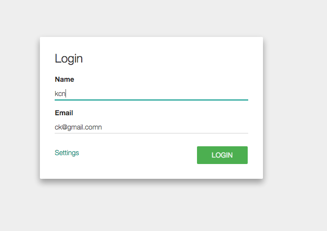

# Component Name:  Login   #
# 1. Functional Description #

The login component is a form to enter specific information. Once it is supplied, the Login button can be clicked. Optionally, the settings link can be clicked and it will display a form to adjust settings.

# 2. Visual Design #

# 3. Component Type #

The Login component will be a pure component.

## a. Required Props ##

| Prop Name | Sample | Description |
| ------------ | ------------- | ------------- |
| settings | settings={ } | An object that contains settings information. |
| compStyle | compStyle={ } | An object that contains css styles. |

[comment]: <> (TODO update object samples once I have the object structure)

## b. Component State ##

This component will maintain it's own state for presentational purposes.

Initial state:

				this.state = {
		advanced: false
		settings: this.props.settings
	}

## c .Component Events ##

Event | Action(s)
------------ | -------------
Login Button Clicked | 1. Invoke the submitLogin function.

## d. Context-Aware Specification ##

This component is NOT context-aware.

# 5. Reference Components #

- VertoBaseComponent
- defineMessages, injectIntl, intlShape, FormattedMessage from react-intl

# 6. Unit Testing Requirement #

Tests for this component are located at:

        src/tests/login-test.js
